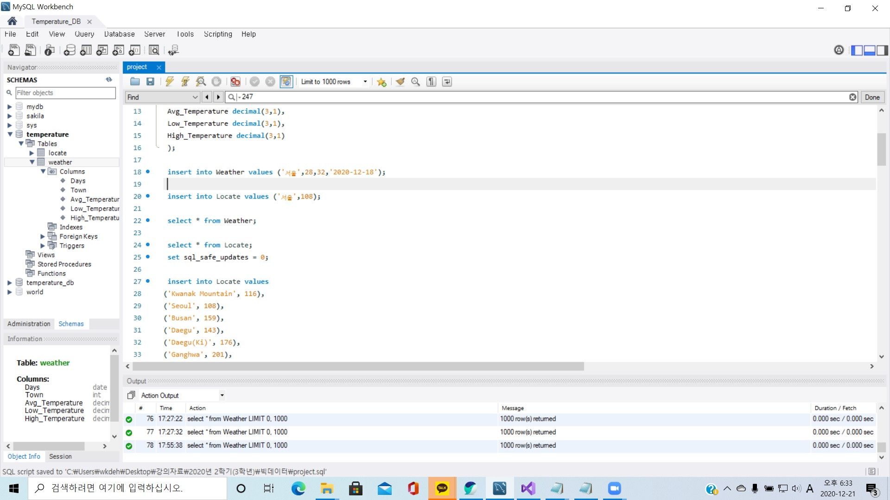
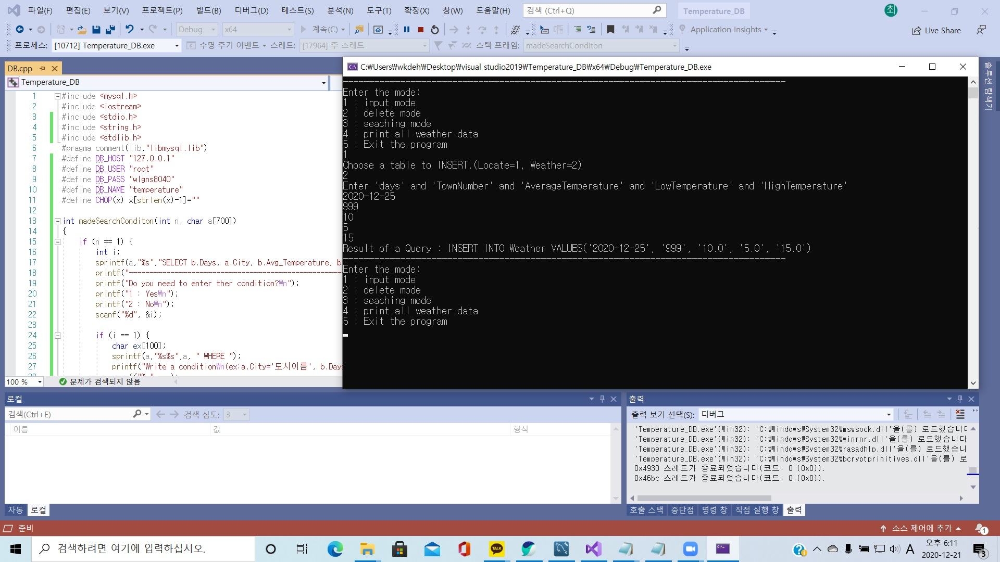
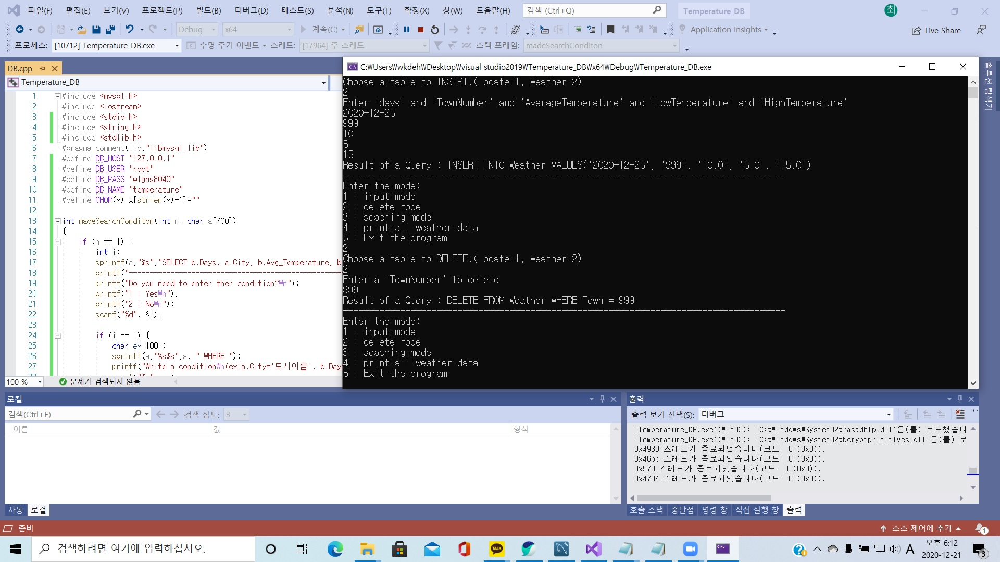

# MySQL을 활용한 간단한 날씨DB 제작
## 개발 목적
학교 수업 때 배운 빅데이터 이론과 SQL의 이론적 지식을 가지고 간단한 데이터베이스 제작 및 C에서의 데이터 삭제, 추가, 검색기능 구현 경험

## 담당 파트
- Visual Studio와 MySQL 연동
- C에서 DB로 접근해 데이터의 삭제, 추가, 검색기능 구현
- C로 간단한 인터페이스 구현

## 개발결과
 
<MySQL 일부분>

 
<프로그램 실행화면>

 
<데이터 추가>

 
<데이터 삭제>

 
<데이터 검색>
